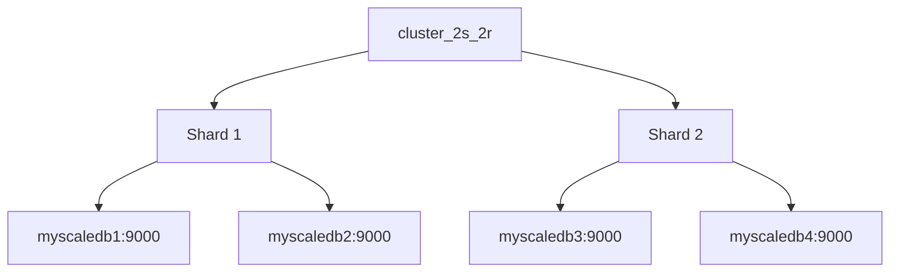

# MyScaleDB docker-compose 使用指南

MyScaleDB 基于开源的 Clickhouse 项目二次开发，使用方式基本上与其相同，在向量索引、搜索上有功能拓展，使用的时候需要提醒注意(截止到20240524)：

+ **Vector Search 现在只测过 MergeTree 和 ReplicatedMergeTree，其他的（Replacing/Summing/...）可能会有问题；**
+ **其他的引擎，存储非向量的数据仍然可以用，就跟普通 Clickhouse 是一样的；**

## 如何使用此docker-compose

启动 docker-compose，要求本机已经安装 docker 以及 docker-compose,然后执行以下步骤：

+ 复制 [.env.example](./.env.example)到同级目录
  + `cp .env.example .env`
+ 修改 .env
  + 根据实际情况，修改 COMPOSE_PROJECT_NAME 的值，避免重复；
+ 选择启动的集群模式，设置 COMPOSE_FILE 的值，其中 docker-compose-base.yaml 是不允许移除的：
  + 单分区一备份模式 `COMPOSE_FILE=docker-compose-base.yaml:docker-compose-1share-2replica.yaml`
    + 提供一个 ***cluster_1s_2r*** 的集群，详情请查看配置文件 [1share2replica_config.xml](./configs/1share2replica_config.xml) 中的`remote_servers`配置项；
  + 双分区无备份模式 `COMPOSE_FILE=docker-compose-base.yaml:docker-compose-2share-1replica.yaml`
    + 提供一个 ***cluster_2s_1r*** 的集群，详情请查看配置文件 [2share1replica_config.xml](./configs/2share1replica_config.xml) 中的`remote_servers`配置项
  + 双分区一备份模式 `COMPOSE_FILE=docker-compose-base.yaml:docker-compose-2share-2replica.yaml`
    + 提供一个 ***cluster_2s_2r*** 的集群，详情请查看配置文件 [2share2replica_config.xml](./configs/2share2replica_config.xml) 中的`remote_servers`配置项
+ 检查本机的端口与配置中的端口是否有冲突，根据实际情况修改端口;
+ 启动本程序前，可提前在本机 pull 运行镜像：
  + myscale/myscaledb:${tag}
  + dbeaver/cloudbeaver:${tag}
    + 提供 B/S 架构的数据库客户端服务，可在浏览器中使用，并访问此 docker-compose 中的 MyScaleDB 实例；
+ 启动此 docker-compose: `docker-compose up -d`
+ 成功启动后，本目录下默认会生成 volumes 文件夹,此文件夹保存这些容器的持久化数据，可以很方便地查看各个实例保存的文件，学习探索 MyScaleDB:

    ```bash
    .
    ├── README.md
    ├── configs  [12 entries exceeds filelimit, not opening dir]
    ├── docker-compose-1share-2replica.yaml
    ├── docker-compose-2share-1replica.yaml
    ├── docker-compose-2share-2replica.yaml
    ├── docker-compose-base.yaml
    └── volumes
        ├── cloudbeaver
        │   └── data
        │       ├── GlobalConfiguration
        │       └── user-projects
        │           └── cbadmin
        ├── keeper1
        │   ├── data
        │   │   ├── logs
        │   │   │   └── changelog_1_100000.bin.zstd
        │   │   ├── snapshots
        │   │   ├── state
        │   │   └── uuid
        │   └── log
        │       ├── clickhouse-keeper.err.log
        │       └── clickhouse-keeper.log
        ├── keeper2
        │   ├── data
        │   │   ├── logs
        │   │   │   └── changelog_1_100000.bin.zstd
        │   │   ├── snapshots
        │   │   ├── state
        │   │   └── uuid
        │   └── log
        │       ├── clickhouse-keeper.err.log
        │       └── clickhouse-keeper.log
        ├── keeper3
        │   ├── data
        │   │   ├── logs
        │   │   │   └── changelog_1_100000.bin.zstd
        │   │   ├── snapshots
        │   │   ├── state
        │   │   └── uuid
        │   └── log
        │       ├── clickhouse-keeper.err.log
        │       └── clickhouse-keeper.log
        ├── myscaledb1
        │   ├── data  [17 entries exceeds filelimit, not opening dir]
        │   └── log
        │       ├── clickhouse-server.err.log
        │       └── clickhouse-server.log
        ├── myscaledb2
        │   ├── data  [17 entries exceeds filelimit, not opening dir]
        │   └── log
        │       ├── clickhouse-server.err.log
        │       └── clickhouse-server.log
        ├── myscaledb3
        │   ├── data  [17 entries exceeds filelimit, not opening dir]
        │   └── log
        │       ├── clickhouse-server.err.log
        │       └── clickhouse-server.log
        └── myscaledb4
            ├── data  [17 entries exceeds filelimit, not opening dir]
            └── log
                ├── clickhouse-server.err.log
                └── clickhouse-server.log

    35 directories, 28 files
    ```

+ 登录用户信息
  + 默认用户 **default** 无密码，只允许在 myscaledb 容器内使用 clickhouse-client 登录使用

    ```bash
    docker exec -it myscaledb1 clickhouse-client --user default --password
    
    # 注意，执行此命令后，系统要求输入密码，请直接回车即可

    ClickHouse client version 23.3.2.1.
    Password for user (default):
    Connecting to localhost:9000 as user default.
    Connected to ClickHouse server version 23.3.2 revision 54462.

    Warnings:
    * Linux is not using a fast clock source. Performance can be degraded. Check /sys/devices/system/clocksource/clocksource0/current_clocksource
    * Table system.session_log is enabled. It's unreliable and may contain garbage. Do not use it for any kind of security monitoring.
    * Some obsolete setting is changed. Check 'select * from system.settings where changed' and read the changelog.

    default@:myscaledb1 :)
    ```

  + 普通用户 **myscaledb**，密码同用户名。

## MyScalceDB 分区与副本的使用说明

集群是副本和分片的基础，它将 ClickHouse 的服务拓扑由单个节点延伸到多个节点，并提供灵活的集群配置方式，在一个集群里配置不同的小集群，小集群中可以有不同的节点、分区以及副本数量。

### MyScaleDB 的引擎

MyScaleDB 基于 ClickHouse 开发，因此基本上全盘继承了 ClickHouse 引擎。不同引擎对于分区和副本有不同的限制，因此了解各个引擎的差异，有助于我们更好地使用 MyScaleDB。以下是截止到20240523一些常见的 ClickHouse 表引擎：

+ MergeTree 系列引擎:
  + MergeTree: 基础引擎，支持主键索引、数据分区。
  + ReplicatedMergeTree: 用于实现数据副本。
  + SummingMergeTree: 用于实时聚合求和。
  + AggregatingMergeTree: 用于实时聚合任意的聚合函数。
  + CollapsingMergeTree: 用于处理重复数据，例如时间序列数据中的取消操作。
  + VersionedCollapsingMergeTree: 带有版本控制的 CollapsingMergeTree。
  + GraphiteMergeTree: 用于存储和查询 Graphite 格式的数据。
+ Log 系列引擎:
  + TinyLog: 简单引擎，用于快速写入小表，数据文件按列独立存储。
  + Log: 支持并发读取，数据文件按列存储。
  + StripeLog: 支持并发读取，所有列数据存储在同一个文件中。
+ 集成外部数据源的引擎:
  + HDFS: 允许直接从 HDFS 读取数据。
  + MySQL: 允许从 MySQL 数据库读取数据。
  + JDBC: 允许从任何支持 JDBC 的数据库读取数据。
  + File: 允许读取文件系统上的数据。
+ 特殊用途的引擎:
  + Distributed: 用于分布式查询，不存储数据。
  + Memory: 将所有数据保存在 RAM 中。
  + Set: 用于存储唯一值。
  + Buffer: 用于在特定条件下将数据异步写入目标表。
  + MaterializedView: 物化视图，根据 SELECT 查询的结果创建。
+ 其他引擎:
  + Join: 用于在运行时执行 JOIN 操作。
  + URL: 允许从 URL 读取数据。
  + Kafka: 用于从 Kafka 读取数据。
  + Redis: 用于从 Redis 读取数据。

以上这些引擎，按照对多分区、多副本的支持进行分类：

+ **支持多分区的引擎**:
  + MergeTree: 支持数据分区。
  + SummingMergeTree: 继承自 MergeTree，支持分区。
  + AggregatingMergeTree: 继承自 MergeTree，支持分区。
  + CollapsingMergeTree: 继承自 MergeTree，支持分区。
  + VersionedCollapsingMergeTree: 继承自 CollapsingMergeTree，支持分区。
  + GraphiteMergeTree: 继承自 MergeTree，支持分区。
+ **支持多副本的引擎**:
  + ReplicatedMergeTree: 专为复制表设计，支持多副本。
+ **既支持多分区，也支持多副本的引擎**:
  + ReplicatedMergeTree: 这是唯一一个既支持多分区也支持多副本的引擎。它结合了 MergeTree 系列引擎的分区特性和复制表引擎的多副本特性。

请注意，虽然 ReplicatedMergeTree 支持多分区和多副本，但是它通常用于特定的集群设置中，需要与 ZooKeeper/ClickHouseKeeper 一起使用以管理副本之间的一致性。

其他引擎，如 TinyLog, Log, StripeLog 等，虽然可能支持分区，但它们通常用于特定的用例，如日志存储，并不支持复制表的特性。而 Distributed, Memory, Set, Buffer 等引擎主要用于特定的查询或数据管理操作，并不直接支持多分区或多副本的特性。在选择表引擎时，需要根据具体的业务需求和集群架构来确定最适合的引擎。

### 在 cluster_2s_2r 集群使用 ReplicatedMergeTree 引擎示例

#### 启动 docker-compose

按照 [如何使用此docker-compose](#如何使用此docker-compose) 步骤在本机启动一套 MyScaleDB 集群，启动成功后，进入 myscaledb1 实例内的 clickhouse-client:

```bash
docker exec -it myscaledb1 clickhouse-client --user default --password
```

查看集群信息：

```sql
default@:myscaledb1 :) show clusters;

SHOW CLUSTERS

Query id: 246fc8bc-d94a-4410-aadb-224278262797

┌─cluster───────┐
│ cluster_2s_2r │
│ default       │
└───────────────┘

2 rows in set. Elapsed: 0.005 sec.
```

进入 myscaledb3 实例内的 clickhouse-client，查看集群信息，获得同样的结果:

``` sql
default@:myscaledb3 :) show clusters;

SHOW CLUSTERS

Query id: 540fd0be-38d7-43ee-82d8-67bb8cc11447

┌─cluster───────┐
│ cluster_2s_2r │
│ default       │
└───────────────┘

2 rows in set. Elapsed: 0.004 sec.
```

查看 keeper 信息，如果一切运行正常，将会看到以下信息：

```sql
default@:myscaledb3 :) SELECT * FROM system.zookeeper WHERE path IN ('/', '/clickhouse');

SELECT *
FROM system.zookeeper
WHERE path IN ('/', '/clickhouse')

Query id: 98042db8-939f-493d-9ac3-eaba0860db63

┌─name───────┬─value─┬─path────────┐
│ keeper     │       │ /           │
│ clickhouse │       │ /           │
│ task_queue │       │ /clickhouse │
│ moqi       │       │ /clickhouse │
└────────────┴───────┴─────────────┘

4 rows in set. Elapsed: 0.007 sec.
```

#### 创建 database + table

由于我们在此 docker-compose 中配置了 [distributed-ddl.xml](./configs/distributed-ddl.xml), 因此创建数据库、创建表支持分布式 DDL，我们在集群内某个节点执行相关操作，其他节点也会同步执行。我们选择 myscaledb4 节点，执行以下命令：

##### 创建数据库

```sql
# 创建 testdb 数据库
default@:myscaledb4 :) CREATE DATABASE testdb ON CLUSTER 'cluster_2s_2r';

CREATE DATABASE testdb ON CLUSTER cluster_2s_2r

Query id: ad2e93ed-fbf6-498f-b8ab-a51066b87c5f

┌─host───────┬─port─┬─status─┬─error─┬─num_hosts_remaining─┬─num_hosts_active─┐
│ myscaledb3 │ 9000 │      0 │       │                   3 │                0 │
│ myscaledb1 │ 9000 │      0 │       │                   2 │                0 │
│ myscaledb4 │ 9000 │      0 │       │                   1 │                0 │
│ myscaledb2 │ 9000 │      0 │       │                   0 │                0 │
└────────────┴──────┴────────┴───────┴─────────────────────┴──────────────────┘

4 rows in set. Elapsed: 0.318 sec.
```

执行成功之后，四个节点的 myscaledb 实例，都已经创建了 testdb 数据库。选择 myscaledb1 节点，执行以下命令：

```sql
default@:myscaledb1 :) select * from system.databases where name='testdb';

SELECT *
FROM system.databases
WHERE name = 'testdb'

Query id: 55f0664b-e796-4821-864f-ece9807fd080

┌─name───┬─engine─────┬─data_path──────────────────┬─metadata_path───────────────────────────────────────────────────────┬─uuid─────────────────────────────────┬─engine_full─────────────────────────────────────────────────────────────┬─comment─┐
│ testdb │ Replicated │ /var/lib/clickhouse/store/ │ /var/lib/clickhouse/store/0dd/0dd896b7-8e88-4b87-94f3-3e8d59b50f5d/ │ 0dd896b7-8e88-4b87-94f3-3e8d59b50f5d │ Replicated('/clickhouse/moqi/databases/testdb', '{shard}', '{replica}') │         │
└────────┴────────────┴────────────────────────────┴─────────────────────────────────────────────────────────────────────┴──────────────────────────────────────┴─────────────────────────────────────────────────────────────────────────┴─────────┘

1 row in set. Elapsed: 0.060 sec.
```

##### 创建数据库的表

在 myscaledb3 上执行 SQL 创建 tablemoqi

```sql
default@:myscaledb3 :) CREATE TABLE testdb.tablemoqi
                       (
                           `id` UInt64,
                           `column1` String
                       )
                       ENGINE = ReplicatedMergeTree
                       ORDER BY column1;

CREATE TABLE testdb.tablemoqi
(
    `id` UInt64,
    `column1` String
)
ENGINE = ReplicatedMergeTree
ORDER BY column1

Query id: 107fe99d-5656-4984-8048-2ea5935e208b

┌─shard─┬─replica────┬─status─┬─num_hosts_remaining─┬─num_hosts_active─┐
│ 02    │ myscaledb3 │ OK     │                   3 │                3 │
└───────┴────────────┴────────┴─────────────────────┴──────────────────┘
┌─shard─┬─replica────┬─status─┬─num_hosts_remaining─┬─num_hosts_active─┐
│ 02    │ myscaledb4 │ OK     │                   2 │                2 │
└───────┴────────────┴────────┴─────────────────────┴──────────────────┘
┌─shard─┬─replica────┬─status─┬─num_hosts_remaining─┬─num_hosts_active─┐
│ 01    │ myscaledb2 │ OK     │                   1 │                1 │
└───────┴────────────┴────────┴─────────────────────┴──────────────────┘
┌─shard─┬─replica────┬─status─┬─num_hosts_remaining─┬─num_hosts_active─┐
│ 01    │ myscaledb1 │ OK     │                   0 │                0 │
└───────┴────────────┴────────┴─────────────────────┴──────────────────┘

4 rows in set. Elapsed: 0.683 sec.
```

> 此处直接声明表的引擎为 ReplicatedMergeTree， 实际测试法相，当声明引擎为 MergeTree，程序会自动转换创建使用 ReplicatedMergeTree 引擎。

在任意其他节点，都可查看到此 tablemoqi 已经创建成功：

```sql
default@:myscaledb4 :) select `database`,name,`uuid`,`engine` from system.tables where name='tablemoqi';

SELECT
    database,
    name,
    uuid,
    engine
FROM system.tables
WHERE name = 'tablemoqi'

Query id: d2ce86d8-caec-4b81-a549-eb2872abf6cb

┌─database─┬─name──────┬─uuid─────────────────────────────────┬─engine──────────────┐
│ testdb   │ tablemoqi │ 39b48ef9-c171-4c18-b0dd-13eea3b1505c │ ReplicatedMergeTree │
└──────────┴───────────┴──────────────────────────────────────┴─────────────────────┘

1 row in set. Elapsed: 0.012 sec.
```

##### 插入数据

cluster_2s_2r 集群的网络拓扑如下图：



需要说明的是，Shard1 与 Shard2 数据是隔离的，在 myscaledb1 操作表数据，相关命令会同步到 myscaledb2，但是不会影响到 myscaledb3、myscaledb4 节点。下面我们通过实际的 SQL 指令验证此结论：

在 myscaledb1 的 clickhouse-client 中执行：

```sql
default@:myscaledb1 :) INSERT INTO testdb.tablemoqi (id, column1) VALUES (1, 'abc1');

INSERT INTO testdb.tablemoqi (id, column1) FORMAT Values

Query id: a24a4892-5fd2-4f28-84c5-108b7e9798ae

Ok.

1 row in set. Elapsed: 0.204 sec.

default@:myscaledb1 :) select * from testdb.tablemoqi;

SELECT *
FROM testdb.tablemoqi

Query id: 656f7731-e176-4754-ad07-fca1c12dc18c

┌─id─┬─column1─┐
│  1 │ abc1    │
└────┴─────────┘

1 row in set. Elapsed: 0.030 sec.
```

进入 myscaledb2 的 clickhouse-client 中执行：

```sql
#######################################
# 查询表数据
#######################################
default@:myscaledb2 :) select * from testdb.tablemoqi;

SELECT *
FROM testdb.tablemoqi

Query id: bd615469-660d-4502-b2cf-b256d14958c2

┌─id─┬─column1─┐
│  1 │ abc1    │
└────┴─────────┘

1 row in set. Elapsed: 0.013 sec.

####################################### 
# 插入新数据
#######################################
default@:myscaledb2 :) INSERT INTO testdb.tablemoqi (id, column1) VALUES (2, 'abc2');

INSERT INTO testdb.tablemoqi (id, column1) FORMAT Values

Query id: 730349bc-18e6-4ac8-845a-2993309cd831

Ok.

1 row in set. Elapsed: 0.206 sec.

#######################################
# 查询表数据
#######################################
default@:myscaledb2 :) select * from testdb.tablemoqi;

SELECT *
FROM testdb.tablemoqi

Query id: 3ef60150-667c-4e11-aeb2-afa2308b74d9

┌─id─┬─column1─┐
│  1 │ abc1    │
└────┴─────────┘
┌─id─┬─column1─┐
│  2 │ abc2    │
└────┴─────────┘

2 rows in set. Elapsed: 0.042 sec.
```

进入 myscaledb3 的 clickhouse-client 中执行：

```sql
#######################################
# 查询表数据
# 我们可以看到，myscaledb1/myscaledb2 插入的数据
# 在 myscaledb3 并没有查询到
#######################################
default@:myscaledb3 :) select * from testdb.tablemoqi;

SELECT *
FROM testdb.tablemoqi

Query id: 12688a16-91d7-4b8a-bb87-8e8d6d98eeeb

Ok.

0 rows in set. Elapsed: 0.005 sec.

####################################### 
# 插入新数据
#######################################
default@:myscaledb3 :) INSERT INTO testdb.tablemoqi (id, column1) VALUES (3, 'abc3');

INSERT INTO testdb.tablemoqi (id, column1) FORMAT Values

Query id: 9d962379-55e8-42dd-b1b2-e6499c6e100d

Ok.

1 row in set. Elapsed: 0.238 sec.
```

进入 myscaledb4 的 clickhouse-client 中执行：

```sql
default@:myscaledb4 :) select * from testdb.tablemoqi;

SELECT *
FROM testdb.tablemoqi

Query id: 34b711f5-afaa-4391-8987-1bbf5f4f577c

┌─id─┬─column1─┐
│  3 │ abc3    │
└────┴─────────┘

1 row in set. Elapsed: 0.028 sec.
```

以上结果可以说明，分区 Shard1 与 Shard2 数据是隔离的。在下一个章节，会介绍如何将两个分区的数据合并查询。

#### 创建 Distributed 分布式表引擎表

Distributed 自身不存储任何数据，而是作为数据分片的透明代理，能够自动路由数据至集群中的各个节点，所以 Distributed 表引擎需要和其他数据表引擎一起协同工作。在任意一个 myscaledb 节点执行以下命令：

```sql
default@:myscaledb4 :) CREATE TABLE testdb.tablemoqi_dist
                       (
                           `id` UInt64,
                           `column1` String
                       )
                       ENGINE = Distributed('cluster_2s_2r', 'testdb', 'tablemoqi', rand());

CREATE TABLE testdb.tablemoqi_dist
(
    `id` UInt64,
    `column1` String
)
ENGINE = Distributed('cluster_2s_2r', 'testdb', 'tablemoqi', rand())

Query id: 2cf95bd7-b0ef-4f7c-bb5c-cee4be38dd96

┌─shard─┬─replica────┬─status─┬─num_hosts_remaining─┬─num_hosts_active─┐
│ 02    │ myscaledb4 │ OK     │                   3 │                3 │
└───────┴────────────┴────────┴─────────────────────┴──────────────────┘
┌─shard─┬─replica────┬─status─┬─num_hosts_remaining─┬─num_hosts_active─┐
│ 01    │ myscaledb1 │ OK     │                   2 │                0 │
│ 02    │ myscaledb3 │ OK     │                   1 │                0 │
│ 01    │ myscaledb2 │ OK     │                   0 │                0 │
└───────┴────────────┴────────┴─────────────────────┴──────────────────┘

4 rows in set. Elapsed: 0.235 sec.
```

一个名为 tablemoqi_dist 的 Distributed 分布式表引擎的表在四个节点都已经创建，此时，在任意节点查询 testdb.tablemoqi_dist，都可以将两个分区的 testdb.tablemoqi 表数据合并在一起查询：

##### 分布式查询

在 myscaledb4 查询 tablemoqi_dist:

```sql
default@:myscaledb4 :) select * from testdb.tablemoqi_dist;

SELECT *
FROM testdb.tablemoqi_dist

Query id: 8917e8e2-f720-40b5-8001-fbd3b7464c08

┌─id─┬─column1─┐
│  3 │ abc3    │
└────┴─────────┘
┌─id─┬─column1─┐
│  1 │ abc1    │
└────┴─────────┘
┌─id─┬─column1─┐
│  2 │ abc2    │
└────┴─────────┘

3 rows in set. Elapsed: 0.051 sec.
```

在 myscaledb2 查询 tablemoqi_dist:

```sql
default@:myscaledb2 :) select * from testdb.tablemoqi_dist;

SELECT *
FROM testdb.tablemoqi_dist

Query id: 8d376b3d-cbc5-4a77-bafc-0b7939c7c2e3

┌─id─┬─column1─┐
│  1 │ abc1    │
└────┴─────────┘
┌─id─┬─column1─┐
│  2 │ abc2    │
└────┴─────────┘
┌─id─┬─column1─┐
│  3 │ abc3    │
└────┴─────────┘

3 rows in set. Elapsed: 0.099 sec.
```

##### 分布式写入

在 myscaledb1 对 testdb.tablemoqi_dist 插入四条数据:

```sql
default@:myscaledb1 :) INSERT INTO testdb.tablemoqi_dist (id, column1) VALUES (4, 'abc4');

INSERT INTO testdb.tablemoqi_dist (id, column1) FORMAT Values

Query id: 93ee6c27-12d1-4883-b393-11af20874e68

Ok.

1 row in set. Elapsed: 0.199 sec.

default@:myscaledb1 :) INSERT INTO testdb.tablemoqi_dist (id, column1) VALUES (5, 'abc5');

INSERT INTO testdb.tablemoqi_dist (id, column1) FORMAT Values

Query id: 6eccc9bf-abfb-49d6-a9d2-3b86f6faafa9

Ok.

1 row in set. Elapsed: 0.035 sec.

default@:myscaledb1 :) INSERT INTO testdb.tablemoqi_dist (id, column1) VALUES (6, 'abc6');

INSERT INTO testdb.tablemoqi_dist (id, column1) FORMAT Values

Query id: 3caa458e-6304-481f-b31c-581dbc80f844

Ok.

1 row in set. Elapsed: 0.041 sec.

default@:myscaledb1 :) INSERT INTO testdb.tablemoqi_dist (id, column1) VALUES (7, 'abc7');

INSERT INTO testdb.tablemoqi_dist (id, column1) FORMAT Values

Query id: b82c00f9-c693-4c23-8f17-4435814af5cd

Ok.

1 row in set. Elapsed: 0.076 sec.

# 查询集群内数据结果

default@:myscaledb1 :) select * from testdb.tablemoqi_dist;

SELECT *
FROM testdb.tablemoqi_dist

Query id: 32dc2a3e-ca06-4776-96c0-f6b001245002

┌─id─┬─column1─┐
│  1 │ abc1    │
│  2 │ abc2    │
└────┴─────────┘
┌─id─┬─column1─┐
│  3 │ abc3    │
│  4 │ abc4    │
│  5 │ abc5    │
│  6 │ abc6    │
│  7 │ abc7    │
└────┴─────────┘

7 rows in set. Elapsed: 0.074 sec

```

在 cluster_2s_2r 集群的配置文件 [2share2replica_config.xml](./configs/2share2replica_config.xml) 中分配配置分片的权重(weight)为 10/20，系统会根据此权重值判断数据存储的集群，实际数据分布会跟本教程有所区别。分别在 myscaledb2、myscaledb3 查看实际存储数据的表 testdb.tablemoqi 记录的数据数量:

在 myscaledb2 中:

```sql
default@:myscaledb2 :) select * from testdb.tablemoqi;

SELECT *
FROM testdb.tablemoqi

Query id: 4cbb09fe-4755-47cd-a7c4-1ca559822a8f

┌─id─┬─column1─┐
│  1 │ abc1    │
│  2 │ abc2    │
└────┴─────────┘

2 rows in set. Elapsed: 0.021 sec.
```

在 myscaledb3 中:

```sql
default@:myscaledb3 :) select * from testdb.tablemoqi;

SELECT *
FROM testdb.tablemoqi

Query id: 1be83841-687d-41aa-9bcf-f3f7ad522fbe

┌─id─┬─column1─┐
│  3 │ abc3    │
│  4 │ abc4    │
│  5 │ abc5    │
│  6 │ abc6    │
│  7 │ abc7    │
└────┴─────────┘

5 rows in set. Elapsed: 0.012 sec.
```

## Reference

+ [Configuring ClickHouse Keeper with unique paths](https://clickhouse.com/docs/en/guides/sre/keeper/clickhouse-keeper#configuring-clickhouse-keeper-with-unique-paths)
+ [clickhouse-keeper](https://clickhouse.com/docs/zh/operations/clickhouse-keeper)
+ [ClickHouse Keeper User Guide](https://clickhouse.com/docs/en/guides/sre/keeper/clickhouse-keeper#clickhouse-keeper-user-guide)
+ [Why is ClickHouse so fast?](https://lewlh.github.io/2024/05/24/WhyIsClickHouseSoFast/)